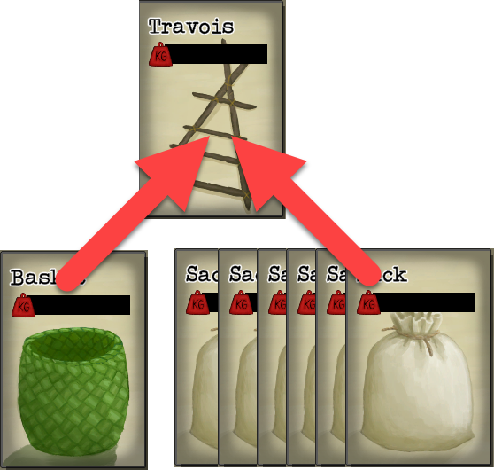

# Load Travois
This mod provides a hotkey to automatically load all available sacks and baskets onto a travois.  This avoids needing to load each container individually.

By default the mod will try to load every sack and then every basket that the travois can fit.  Baskets that are "placed" in a location are not included.

The mod can be configured to only load certain items.  See [Settings](#settings).

# Settings
|Name|Default|Description|
|--|--|--|
|CardMoveListConfig|Sack,Basket|The list of items to attempt to load, in order of preference|
|HotKey|I|The hotkey to invoke the loading process|

A list of HotKey names can be found here: https://docs.unity3d.com/ScriptReference/KeyCode.html.  However, it is easier to use the configuration manager mod which provides an in game configuration UI (see [Using Configuration Manager](#using-configuration-manager) below)

A list of card names for the CardMoveListConfig setting can be found at https://github.com/NBKRedSpy/CardSurvival-DoNotSteal/blob/master/CardList.txt


# Changing the Configuration

## Using Configuration Manager
The ConfigManager mod provides an in game UI to manage all mod's settings by pressing F1.  Some settings will not take effect until the game is restarted.

ConfigManager Web page: https://github.com/BepInEx/BepInEx.ConfigurationManager/ .  
ConfigManager Mod download:  https://github.com/BepInEx/BepInEx.ConfigurationManager/releases

## Manually Changing

All options are contained in the config file which is located at ```<Steam Directory>\steamapps\common\Card Survival Tropical Island\BepInEx\config\CardSurvival-LoadTravois.cfg```.

The .cfg file will not exist until the mod is installed and then the game is run.

To reset the config, delete the config file.  A new config will be created the next time the game is run.

# Installation 
This section describes how to manually install the mod.

**If using the Vortex mod manager from NexusMods, these steps are not needed.**

## Overview
This mod requires the BepInEx mod loader.

## BepInEx Setup
If BepInEx has already been installed, skip this section.

Download BepInEx from https://github.com/BepInEx/BepInEx/releases/download/v5.4.21/BepInEx_x64_5.4.21.0.zip

* Extract the contents of the BepInEx zip file into the game's directory:
```<Steam Directory>\steamapps\common\Card Survival Tropical Island```

    __Important__:  The .zip file *must* be extracted to the root folder of the game.  If BepInEx was extracted correctly, the following directory will exist: ```<Steam Directory>\steamapps\common\Card Survival Tropical Island\BepInEx```.  This is a common install issue.

* Run the game.  Once the main menu is shown, exit the game.
    
* In the BepInEx folder, there will now be a "plugins" directory.

## Mod Setup
* Download the CardSurvival-LoadTravois.zip.  
    * If on Nexumods.com, download from the Files tab.
    * Otherwise, download from https://github.com/NBKRedSpy/CardSurvival-CardSurvival-LoadTravois/releases/

* Extract the contents of the zip file into the ```BepInEx/plugins``` folder.

* Run the Game.  The mod will now be enabled.

# Uninstalling

## Uninstall
This resets the game to an unmodded state.

Delete the BepInEx folder from the game's directory
```<Steam Directory>\steamapps\common\Card Survival Tropical Island\BepInEx```

## Uninstalling This Mod Only

This method removes this mod, but keeps the BepInEx mod loader and any other mods.

Delete the ```CardSurvival-LoadTravois.dll``` from the ```<Steam Directory>\steamapps\common\Card Survival Tropical Island\BepInEx\plugins``` directory.

# Compatibility
Safe to add and remove from existing saves.

# Credits
<a href="https://www.flaticon.com/free-icons/like" title="like icons">Like icons created by Pixel perfect - Flaticon</a>
<a href="https://www.flaticon.com/free-icons/thumbs-down" title="thumbs down icons">Thumbs down icons created by Freepik - Flaticon</a>

# Change Log 

## 1.1.2
* Fixes load failing if there is more than one Travois in the current environment.

## 1.1.1
* Fixes mod not working for non English languages.  Thank you to CialloAlone for creating the fix.

## 1.1.0
* Corrected container search not being limited to the current environment.

## 1.0.0
* Release


